# Dento Smart Firmware

Firmware ini adalah perangkat lunak untuk `ESP32-C3-DevKitM-1` yang mengendalikan sistem monitoring fisiologis sederhana dengan menu OLED, pembacaan multi-sensor, pengukuran blood pressure berbasis cuff, konektivitas WiFi, dan upload data ke backend.

Project dibangun dengan:

- `PlatformIO`
- framework `Arduino`
- multitasking `FreeRTOS` bawaan ESP32

## Tujuan Sistem

Perangkat ini dirancang untuk:

- membaca `GSR`, suhu tubuh, heart rate, dan tekanan cuff
- menampilkan status dan menu di OLED
- menerima kontrol dari 4 pushbutton
- menjalankan siklus blood pressure dengan pump dan solenoid valve
- mengirim data ke backend jika WiFi tersedia
- menyimpan payload offline jika upload gagal

## Ringkasan Komponen

| Komponen | Fungsi |
|---|---|
| `ESP32-C3-DevKitM-1` | kontrol utama sistem |
| `OLED SH1106 128x64` | tampilan menu dan data |
| `Pushbutton x4` | navigasi UI |
| `GSR sensor` | pembacaan skin response |
| `DS18B20` | pembacaan suhu |
| `MAX30102` | pembacaan sinyal heart rate |
| `HX710B` | pembacaan tekanan cuff |
| `L9110` + pump | inflasi cuff |
| `L9110` + solenoid valve | kontrol pembuangan udara |
| `WiFiManager` | captive portal konfigurasi WiFi |
| `Backend API` | penerimaan data sensor |

## Arsitektur Sistem

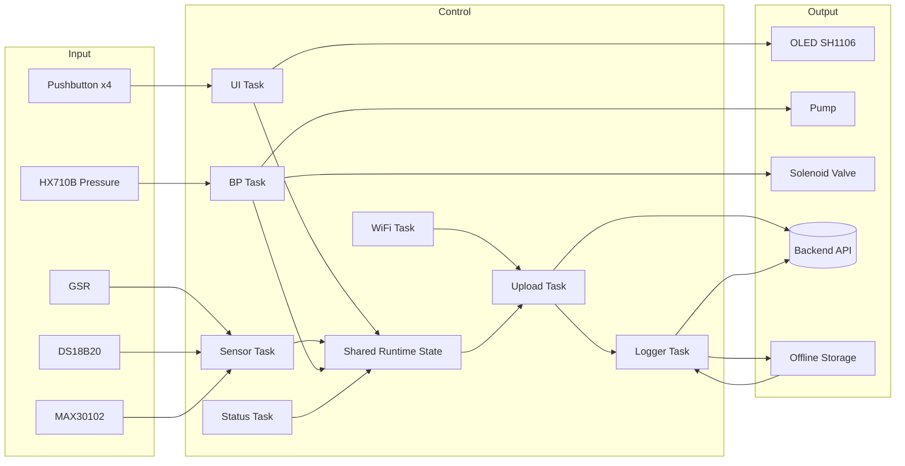

## Cara Kerja Sistem

### Alur Tingkat Tinggi

1. Board menyala dan menginisialisasi peripheral utama.
2. Driver sensor, display, button, storage, dan WiFi disiapkan.
3. RTOS object seperti queue, mutex, dan event group dibuat.
4. Task utama dijalankan paralel.
5. Sensor dibaca periodik dan state sistem diperbarui.
6. UI merender menu dan menerima input tombol.
7. Saat user memulai blood pressure, controller pneumatic mengatur pump dan valve.
8. Data sensor dikemas dan dicoba upload ke backend.
9. Jika upload gagal, payload masuk antrean offline lalu direplay saat WiFi kembali.

### Flowchart Startup

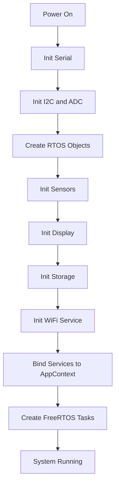

## Cara Kerja Per Task

Firmware utama menggunakan beberapa task yang berjalan paralel.

### 1. `sensor_task`

Tugas:

- update `DS18B20`
- update `MAX30102`
- baca `GSR`
- ambil tekanan cuff dan hasil BP terbaru
- simpan snapshot sensor terakhir ke shared state
- kirim snapshot ke queue upload

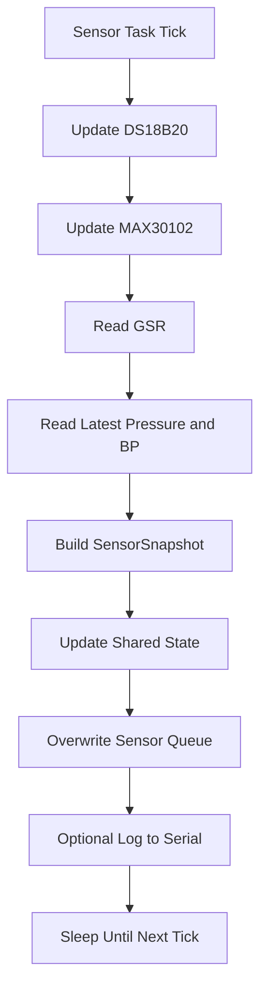

### 2. `ui_task`

Tugas:

- polling tombol dengan interval cepat
- memproses event tombol ke `MenuController`
- memicu portal WiFi jika diminta dari menu
- merender layar OLED berkala

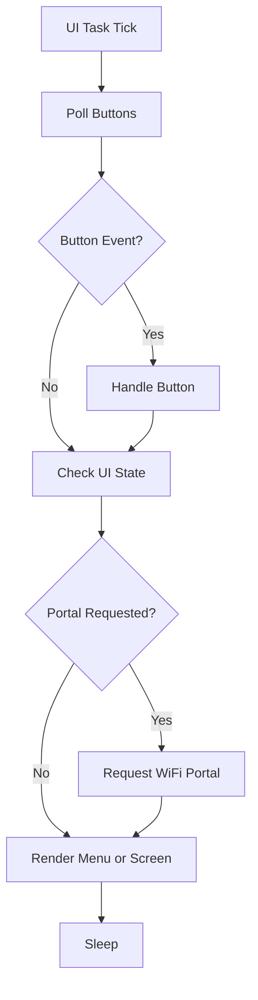

### 3. `bp_task`

Tugas:

- mendeteksi request blood pressure
- menjalankan `PneumaticController`
- memperbarui state BP ke shared state
- mengatur bit event BP running/complete/error

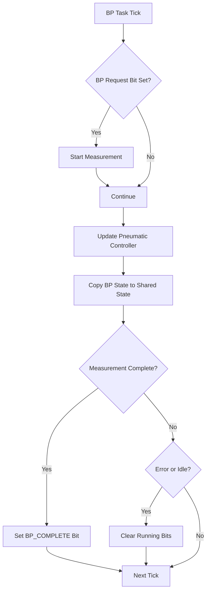

### 4. `wifi_task`

Tugas:

- menjaga koneksi WiFi
- mengaktifkan captive portal saat dibutuhkan
- memperbarui `WIFI_CONNECTED` event bit

### 5. `upload_task`

Tugas:

- ambil snapshot sensor terbaru
- bangun payload JSON
- upload ke backend jika WiFi aktif
- retry beberapa kali
- jika tetap gagal, kirim ke queue logger offline

### 6. `logger_task`

Tugas:

- menyimpan payload gagal ke storage offline
- replay payload lama saat WiFi kembali tersedia

### 7. `status_task`

Tugas:

- mengirim log berkala untuk heap, status WiFi, UI, BP, queue, dan nilai sensor

## Diagram Alur Data

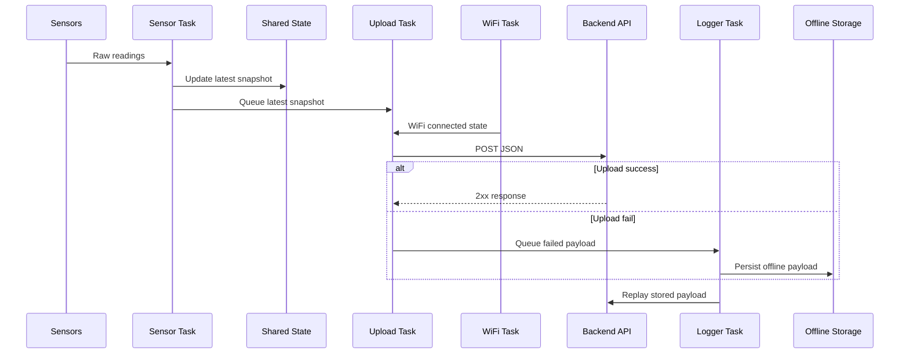

## Cara Kerja Blood Pressure

### Rangkaian Pneumatic

Jalur udara:

`pump -> cuff -> T-joint -> HX710B pressure sensor -> solenoid valve -> exhaust`

### Diagram Pneumatic

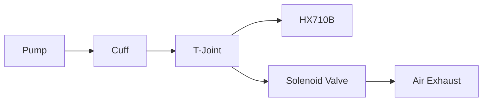

### Metode Pengukuran

Controller BP sekarang sudah tidak memakai nilai sistolik/diastolik placeholder. Implementasi saat ini bekerja seperti ini:

1. pump menaikkan tekanan cuff sampai target
2. sistem menahan sebentar pada fase `HOLD`
3. valve dibuka dalam pulsa kecil agar deflasi lebih terkontrol
4. selama deflasi, sinyal tekanan dipisah menjadi:
   - komponen tekanan cuff dasar
   - komponen osilasi denyut
5. envelope amplitudo osilasi disimpan terhadap tekanan cuff
6. amplitudo puncak dianggap sebagai `MAP envelope peak`
7. sistolik dan diastolik dihitung dari crossing rasio envelope terhadap amplitudo maksimum

### State Machine Blood Pressure

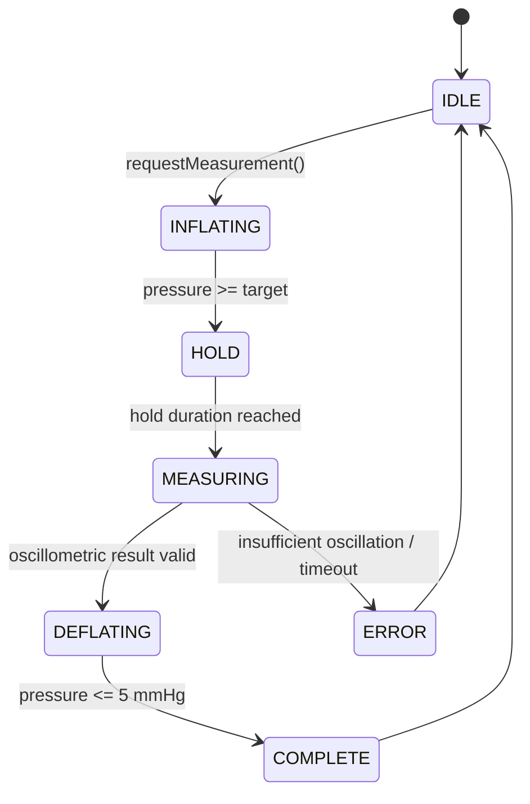

### Flowchart Pengukuran BP

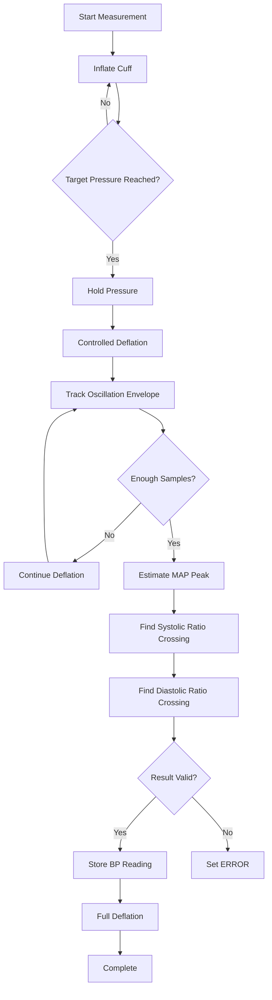

### Blood Pressure Debug Mode

Env debug BP menyediakan mode manual dan otomatis:

- manual:
  - hidup/matikan pump sendiri
  - hidup/matikan valve sendiri
- otomatis:
  - jalankan state machine lengkap BP

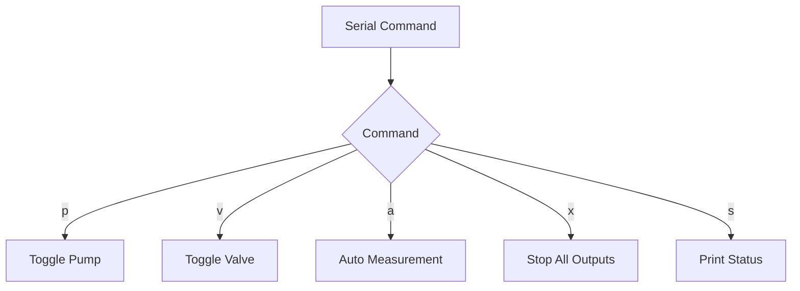

## Cara Kerja UI dan Menu

### Tombol

Empat tombol memakai `INPUT_PULLUP`, sehingga:

- idle = `HIGH`
- ditekan = `LOW` ke `GND`

Jenis event:

- `SHORT_PRESS`
- `LONG_PRESS`

### Diagram Navigasi UI

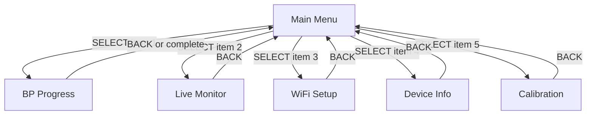

## Wiring

Konfigurasi pin utama ada di [src/config/AppConfig.h](/d:/Aerasea/dento-smart/frimware/dento-smart/src/config/AppConfig.h:1).

### Ringkasan Pin

| Fungsi | GPIO |
|---|---:|
| Pump | `5` |
| Solenoid valve | `6` |
| Button UP | `7` |
| Button DOWN | `10` |
| Button SELECT | `20` |
| Button BACK | `21` |
| I2C SDA | `8` |
| I2C SCL | `9` |
| HX710B SCK | `4` |
| HX710B DOUT | `2` |
| GSR analog | `3` |
| DS18B20 | `1` |

### Diagram Wiring Logika

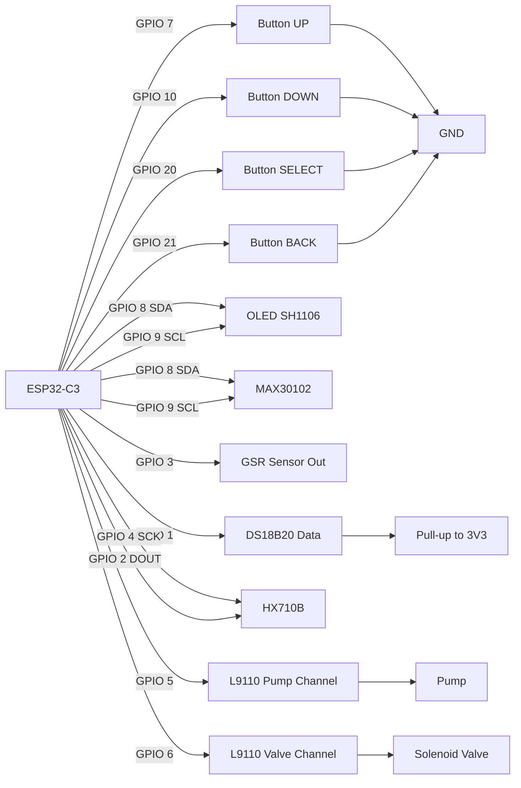

### Wiring Driver L9110 untuk Blood Pressure

- `A1-A -> GPIO 5` untuk pump
- `A1-B -> GND`
- `B1-A -> GPIO 6` untuk solenoid valve
- `B1-B -> GND`

Dengan skema ini:

- `HIGH` = output aktif
- `LOW` = output mati

## WiFi dan Backend

### Firmware Utama

Firmware utama menggunakan `WiFiManager`:

- jika belum ada koneksi tersimpan, perangkat dapat membuka captive portal
- task WiFi akan terus memantau status koneksi
- task upload hanya mengirim data saat event bit `WIFI_CONNECTED` aktif

### Debug Backend

Env backend debug menambahkan fallback:

- SSID: `Aerasea`
- password: `Mtc280823`

Jika fallback gagal, sistem akan masuk ke captive portal.

### Flowchart Koneksi dan Upload

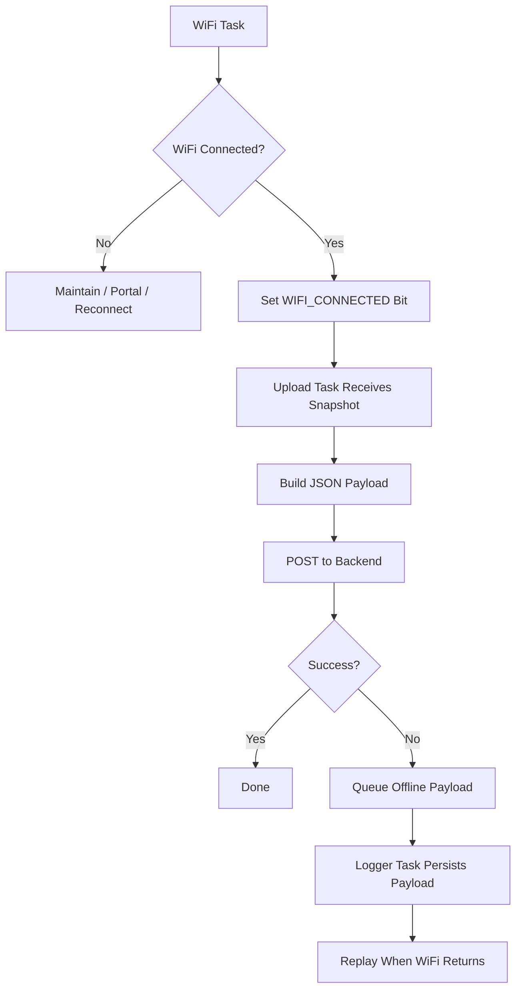

## Struktur Environment PlatformIO

### Firmware Utama

| Env | Fungsi |
|---|---|
| `esp32-c3-devkitm-1` | firmware utama lengkap |

### Firmware Debug

| Env | Fungsi |
|---|---|
| `esp32-c3-debug-button` | test 4 tombol via serial |
| `esp32-c3-debug-gsr` | test sensor GSR |
| `esp32-c3-debug-ds18b20` | test sensor DS18B20 |
| `esp32-c3-debug-hx710b` | test sensor tekanan HX710B |
| `esp32-c3-debug-bp` | test blood pressure, pump, valve, pressure sensor |
| `esp32-c3-debug-max30102` | test sensor MAX30102 |
| `esp32-c3-debug-backend` | test WiFi dan pengiriman data ke backend |

## Menjalankan Project

### Jika `pio` tidak ada di PATH

Gunakan:

```powershell
& "$env:USERPROFILE\.platformio\penv\Scripts\platformio.exe" <command>
```

## Command Firmware Utama

### Build

```powershell
& "$env:USERPROFILE\.platformio\penv\Scripts\platformio.exe" run -e esp32-c3-devkitm-1
```

### Upload

```powershell
& "$env:USERPROFILE\.platformio\penv\Scripts\platformio.exe" run -e esp32-c3-devkitm-1 -t upload
```

### Serial Monitor

```powershell
& "$env:USERPROFILE\.platformio\penv\Scripts\platformio.exe" device monitor -b 115200
```

### Upload + Monitor

```powershell
& "$env:USERPROFILE\.platformio\penv\Scripts\platformio.exe" run -e esp32-c3-devkitm-1 -t upload -t monitor
```

## Command Tiap Env Debug

### Button

```powershell
& "$env:USERPROFILE\.platformio\penv\Scripts\platformio.exe" run -e esp32-c3-debug-button -t upload -t monitor
```

### GSR

```powershell
& "$env:USERPROFILE\.platformio\penv\Scripts\platformio.exe" run -e esp32-c3-debug-gsr -t upload -t monitor
```

### DS18B20

```powershell
& "$env:USERPROFILE\.platformio\penv\Scripts\platformio.exe" run -e esp32-c3-debug-ds18b20 -t upload -t monitor
```

### HX710B

```powershell
& "$env:USERPROFILE\.platformio\penv\Scripts\platformio.exe" run -e esp32-c3-debug-hx710b -t upload -t monitor
```

### Blood Pressure

```powershell
& "$env:USERPROFILE\.platformio\penv\Scripts\platformio.exe" run -e esp32-c3-debug-bp -t upload -t monitor
```

Command serial:

- `h` atau `?` = help
- `a` = start auto measurement
- `x` = stop semua output
- `p` = toggle pump manual
- `v` = toggle valve manual
- `s` = print status

### MAX30102

```powershell
& "$env:USERPROFILE\.platformio\penv\Scripts\platformio.exe" run -e esp32-c3-debug-max30102 -t upload -t monitor
```

### Backend

```powershell
& "$env:USERPROFILE\.platformio\penv\Scripts\platformio.exe" run -e esp32-c3-debug-backend -t upload -t monitor
```

## Alur Pengujian yang Disarankan

Jika merakit hardware dari nol, urutan aman untuk test:

1. test `button`
2. test `gsr`
3. test `ds18b20`
4. test `hx710b`
5. test `max30102`
6. test `bp`
7. test `backend`
8. baru upload env utama

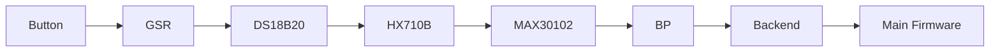

## Endpoint Backend

Endpoint yang dipakai saat ini:

`https://dento-backend.inkubasistartupunhas.id/api/sensor-data`

Header autentikasi:

- `X-DEVICE-KEY`

## Catatan Penting

- pushbutton memakai `INPUT_PULLUP`, jadi wiring tombol harus menutup ke `GND`
- task UI mem-poll tombol lebih cepat dari refresh OLED agar short press tidak terlewat
- blood pressure sekarang sudah memakai estimasi oscillometric dasar, tetapi tetap butuh tuning dan validasi hardware
- payload upload yang gagal tidak langsung hilang, tetapi masuk mekanisme offline logging
- beberapa warning build berasal dari library pihak ketiga dan tidak menghentikan build

## File Penting

- [platformio.ini](/d:/Aerasea/dento-smart/frimware/dento-smart/platformio.ini:1)
- [src/main.cpp](/d:/Aerasea/dento-smart/frimware/dento-smart/src/main.cpp:1)
- [src/config/AppConfig.h](/d:/Aerasea/dento-smart/frimware/dento-smart/src/config/AppConfig.h:1)
- [src/tasks/UiTask.cpp](/d:/Aerasea/dento-smart/frimware/dento-smart/src/tasks/UiTask.cpp:1)
- [src/tasks/SensorTask.cpp](/d:/Aerasea/dento-smart/frimware/dento-smart/src/tasks/SensorTask.cpp:1)
- [src/tasks/WifiTask.cpp](/d:/Aerasea/dento-smart/frimware/dento-smart/src/tasks/WifiTask.cpp:1)
- [src/tasks/UploadTask.cpp](/d:/Aerasea/dento-smart/frimware/dento-smart/src/tasks/UploadTask.cpp:1)
- [src/tasks/LoggerTask.cpp](/d:/Aerasea/dento-smart/frimware/dento-smart/src/tasks/LoggerTask.cpp:1)
- [src/drivers/PneumaticController.cpp](/d:/Aerasea/dento-smart/frimware/dento-smart/src/drivers/PneumaticController.cpp:1)
- [src/network/WiFiService.cpp](/d:/Aerasea/dento-smart/frimware/dento-smart/src/network/WiFiService.cpp:1)
- [src/network/ApiClient.cpp](/d:/Aerasea/dento-smart/frimware/dento-smart/src/network/ApiClient.cpp:1)
